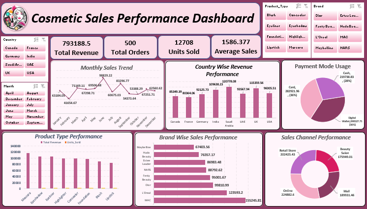

💄 Cosmetic Sales Performance Dashboard (Excel Project)
 

📌 Project Overview :-

This project involves an in-depth sales analysis of a Cosmetic Retail Brand — a company specializing in beauty and personal care products across categories such as Lipstick, Foundation, Eyeshadow, Concealer, Highlighter, Mascara, Blush, and Eyeliner. The goal is to derive actionable business insights by analyzing sales data from 2025 to help the company optimize its sales strategy, improve brand performance, and enhance customer satisfaction across global markets.

🎯 Business Problem Statement :-

The dataset contains detailed information about products, orders, brands, countries, and sales channels. Using this data, the project aims to address the following key business questions:

Total Revenue: What is the overall revenue generated across all markets?
Order Volume Analysis: How many total orders and units were sold in 2025?
Monthly Sales Performance: How do sales fluctuate month-wise across the year 2025?
Top Brands by Revenue: Which brands contribute the most to total revenue?
Average Sales per Order: What is the average spending per order?
Product Type Performance: How do different product categories perform in revenue and units sold?
Top 8 Countries by Revenue: Which countries generate the highest order volume and revenue?
Sales Channel Performance: Which channel — Online, Retail, Mail, or Beauty Salon — drives the most sales?
Payment Mode Distribution: How do customers prefer to pay — Cash, Card, or Digital Wallet?
Brand Popularity by Country: Which brands are most popular in specific markets?
🛠️ Tools and Approach :-

Data Loading & Cleaning: Imported raw sales data into Excel and performed cleaning and transformation for accurate analysis
Data Modeling: Structured the data using Pivot Tables and custom calculated measures
Analysis: Conducted detailed data exploration through Pivot Tables and Charts to uncover trends and answer key business questions
Visualization: Created an interactive dashboard featuring Slicers, Charts, and KPIs to provide a comprehensive and easy-to-understand view of sales performance
Outcome: A dynamic Excel dashboard summarizing key insights for business stakeholders
🗂️ Dataset Information :-

Dataset Name: Cosmetic Sales Data 2025
Time Period: January 2025 – December 2025
Total Records: 500 Orders
Columns Included: Order ID, Transaction Date, Product Type, Brand, Country, Units Sold, Unit Price, Total Revenue, Payment Mode, Sales Channel, etc.
📊 Dashboard Features :-

The dashboard includes the following visualizations:

📈 Monthly Sales Trend (Line Chart)
🌍 Country Wise Revenue Performance (Bar Chart)
🏷️ Brand Wise Sales Performance (Horizontal Bar Chart)
🎨 Product Type Performance — Revenue vs Units Sold (Combo Chart)
💳 Payment Mode Usage (Pie Chart)
🛍️ Sales Channel Performance (Donut Chart)
📦 Interactive Filters — Month, Country, Product Type & Brand (Slicers)
💡 Key Insights (Summary) :-

Total revenue of $793,189 generated across 8 countries from 500 orders in 2025
Average order value of $1,586 confirms a premium product positioning strategy
Monthly sales trend reveals seasonal fluctuations with a peak of $88,829 and low of $41,654 — indicating need for Q1 promotional campaigns
MAC ($155,246) is the top-performing brand, contributing nearly 20% of total revenue — the clear market leader
Maybelline ($67,404) is the lowest-performing brand despite mass-market reach — indicating a pricing or visibility gap
Saudi Arabia ($120,778) leads all markets, followed by UK and India — core revenue-generating geographies identified
France ($80,364) is the weakest market — requiring localized strategy and targeted marketing
Online channel ($224,883) is the top sales driver, confirming strong e-commerce presence
Mail channel ($189,932) performs surprisingly well — indicating an effective D2C or subscription model
72% of payments are cashless (Card 36% + Digital Wallet 36%) — reflecting a digitally mature and trust-based customer base
Lipstick and Foundation categories drive the highest revenue among all product types
Blush and Eyeshadow show high unit sales but lower revenue — volume-driven, margin-sensitive segments
✅ Conclusion :-

The analysis highlights strong global revenue generation across premium brand segments and diverse sales channels. However, it also reveals clear opportunities — addressing the Q1 seasonal dip, boosting underperforming brands like Maybelline, strengthening the France market, and leveraging the growing Mail and Online channels.

By focusing on upselling, cross-selling, occasion-based promotions, and targeted geographic campaigns, the business can significantly enhance its overall profitability and market reach.

